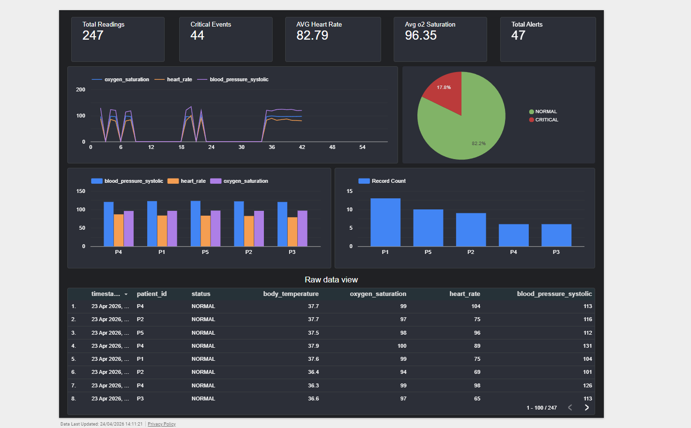
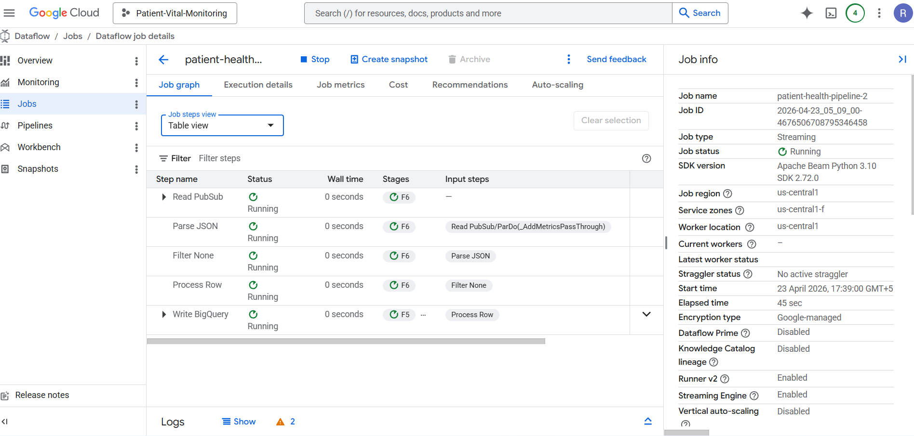
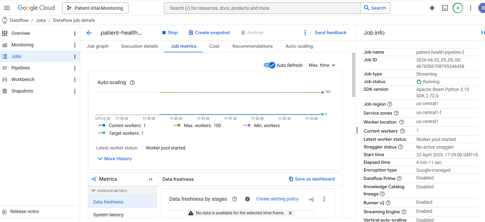

# 🏥 Real-Time Patient Vitals Monitoring System

A production-grade, end-to-end streaming data pipeline that ingests simulated patient vitals in real time, processes and classifies them using Apache Beam on Google Cloud Dataflow, stores results in BigQuery, and visualizes everything on a live Looker Studio dashboard.

---

## 📊 Dashboard



> Live Looker Studio dashboard — 247 readings across 5 patients with scorecards, time series, status breakdown pie chart, critical events bar chart, and paginated raw data table.

---

## ☁️ Dataflow Pipeline — Job Graph



> Apache Beam streaming job running on Google Cloud Dataflow (`us-central1`). All 5 steps — Read PubSub → Parse JSON → Filter None → Process Row → Write BigQuery — running simultaneously.

---

## 📈 Dataflow Pipeline — Job Metrics



> Auto-scaling metrics for the Dataflow job. Current workers: 1, Max workers: 100. Worker pool started successfully. Job elapsed time: 4 min 11 sec.

---

## 🏗️ Architecture

```
┌─────────────────┐     ┌──────────────────────┐     ┌──────────────────────┐
│  Data Generator │────▶│  Google Cloud Pub/Sub │────▶│  Apache Beam         │
│  (publish.py)   │     │  patient-data-topic   │     │  on Cloud Dataflow   │
│  every 2 secs   │     │  patient-sub          │     │  (Streaming)         │
└─────────────────┘     └──────────────────────┘     └──────────┬───────────┘
                                                                  │
                                                    ┌─────────────▼─────────────┐
                                                    │     Beam Transforms        │
                                                    │  1. Parse JSON             │
                                                    │  2. Filter nulls           │
                                                    │  3. Run alert checks       │
                                                    │  4. Set NORMAL / CRITICAL  │
                                                    └─────────────┬─────────────┘
                                                                  │
                                                    ┌─────────────▼─────────────┐
                                                    │        BigQuery            │
                                                    │  patient_data.             │
                                                    │  patient_stream            │
                                                    └─────────────┬─────────────┘
                                                                  │
                                                    ┌─────────────▼─────────────┐
                                                    │      Looker Studio         │
                                                    │      Live Dashboard        │
                                                    └───────────────────────────┘
```

---

## ✨ Features

- **Real-time streaming** — Patient vitals published every 2 seconds via Pub/Sub
- **Automated alert detection** — 9 alert types covering heart rate, BP, oxygen, temperature, and respiratory rate
- **Status classification** — Each reading automatically tagged as `NORMAL` or `CRITICAL`
- **Scalable pipeline** — Runs locally via DirectRunner or at scale on Google Cloud Dataflow (up to 100 workers)
- **Live dashboard** — Looker Studio report with scorecards, time series, pie chart, and raw data table
- **BigQuery sink** — Append-only streaming writes with auto schema creation

---

## 🚨 Alert Logic

The alerting engine (`src/monitoring/alerting.py`) evaluates every incoming reading against clinical thresholds:

| Vital Sign | Alert | Threshold |
|---|---|---|
| Heart Rate | `LOW_HEART_RATE` | < 50 bpm |
| Heart Rate | `HIGH_HEART_RATE` | > 120 bpm |
| Systolic BP | `LOW_BP` | < 90 mmHg |
| Systolic BP | `HIGH_BP` | > 140 mmHg |
| Oxygen Saturation | `LOW_OXYGEN` | < 92% |
| Body Temperature | `LOW_TEMP` | < 35°C |
| Body Temperature | `HIGH_TEMP` | > 38°C |
| Respiratory Rate | `LOW_RESP_RATE` | < 12 /min |
| Respiratory Rate | `HIGH_RESP_RATE` | > 25 /min |

A reading with any triggered alert is classified as `CRITICAL`; otherwise `NORMAL`.

---

## 📁 Project Structure

```
patient-vitals-pipeline/
│
├── src/
│   ├── __init__.py
│   ├── monitoring/
│   │   ├── __init__.py
│   │   └── alerting.py          # Alert detection logic
│   │
│   ├── processing/
│   │   ├── __init__.py
│   │   └── pipeline.py          # Apache Beam pipeline (Pub/Sub → BigQuery)
│   │
│   └── publisher/
│       ├── __init__.py
│       ├── data_generator.py    # Simulated patient vitals generator
│       └── publish.py           # Pub/Sub publisher (runs continuously)
│
├── assets/
│   ├── dashboard.png            # Looker Studio dashboard screenshot
│   ├── dataflow_job.png         # Dataflow job graph screenshot
│   └── dataflow_metrics.png     # Dataflow job metrics screenshot
│──sql/
│   └── alerts_dashboard.sql
├── sample_data.csv              # Sample BigQuery export (247 rows)
├── requirements.txt
├── .gitignore
└── README.md
```

---

## 🛠️ Tech Stack

| Layer | Technology |
|---|---|
| Data simulation | Python — custom data generator |
| Message broker | Google Cloud Pub/Sub |
| Stream processing | Apache Beam 2.55 / Google Cloud Dataflow |
| Data warehouse | Google BigQuery |
| Visualization | Looker Studio |
| Language | Python 3.10 |
| SDK | Apache Beam Python SDK 2.72.0 |
| GCP project | `Patient-Vital-Monitoring` |
| GCP region | `us-central1` |

---

## ⚙️ Setup & Installation

### Prerequisites

- Python 3.9+
- Google Cloud SDK (`gcloud`) installed and authenticated
- A GCP project with Pub/Sub, Dataflow, and BigQuery APIs enabled

### 1. Clone the repository

```bash
git clone https://github.com/your-username/patient-vitals-pipeline.git
cd patient-vitals-pipeline
```

### 2. Install dependencies

```bash
pip install -r requirements.txt
```

### 3. Authenticate with Google Cloud

```bash
gcloud auth application-default login
gcloud config set project southern-engine-493410-b9
```

### 4. Create GCP resources

```bash
# Create Pub/Sub topic and subscription
gcloud pubsub topics create patient-data-topic
gcloud pubsub subscriptions create patient-sub --topic=patient-data-topic

# Create BigQuery dataset (table is auto-created by the pipeline)
bq mk patient_data
```

---

## 🚀 Running the Pipeline

### Step 1 — Start the Beam pipeline

**Local (DirectRunner) — for development/testing:**

```bash
python -m src.processing.pipeline
```

**Production (Dataflow) — for scalable deployment:**

```bash
python -m src.processing.pipeline \
  --runner=DataflowRunner \
  --temp_location=gs://southern-engine-493410-b9-dataflow/temp \
  --staging_location=gs://southern-engine-493410-b9-dataflow/staging \
  --region=us-central1 \
  --job_name=patient-health-pipeline \
  --project=southern-engine-493410-b9
```

### Step 2 — Start the data publisher

Open a **separate terminal** and run:

```bash
python -m src.publisher.publish
```

This publishes a new patient reading every 2 seconds. Sample output:

```
Published: {'patient_id': 'P3', 'heart_rate': 118, 'blood_pressure_systolic': 122, ...}
Published: {'patient_id': 'P1', 'heart_rate': 128, 'blood_pressure_systolic': 145, ...}
```

### Step 3 — Query results in BigQuery

```sql
SELECT
  patient_id,
  timestamp,
  status,
  alerts,
  heart_rate,
  blood_pressure_systolic,
  oxygen_saturation,
  body_temperature
FROM `southern-engine-493410-b9.patient_data.patient_stream`
ORDER BY timestamp DESC
LIMIT 50;
```

---

## 📈 BigQuery Schema

| Column | Type | Description |
|---|---|---|
| `patient_id` | STRING | Patient identifier (P1–P5) |
| `timestamp` | TIMESTAMP | UTC time of reading |
| `heart_rate` | INTEGER | Beats per minute |
| `blood_pressure_systolic` | INTEGER | Systolic BP (mmHg) |
| `blood_pressure_diastolic` | INTEGER | Diastolic BP (mmHg) |
| `oxygen_saturation` | INTEGER | SpO2 percentage |
| `respiratory_rate` | INTEGER | Breaths per minute |
| `body_temperature` | FLOAT | Temperature in °C |
| `device_id` | STRING | IoT device ID (D1–D3) |
| `hospital_id` | STRING | Hospital identifier (H1–H2) |
| `room_number` | STRING | Room number (R1–R20) |
| `bed_number` | STRING | Bed number (B1–B5) |
| `alerts` | STRING | Comma-separated alert codes (empty if none) |
| `status` | STRING | `NORMAL` or `CRITICAL` |

---

## 📊 Looker Studio Dashboard

Connect to BigQuery and build the following components:

| Component | Config |
|---|---|
| Scorecard — Total Readings | Metric: Record Count |
| Scorecard — Critical Events | Metric: Record Count, Filter: status = CRITICAL |
| Scorecard — Avg Heart Rate | Metric: AVG(heart_rate) |
| Scorecard — Avg O₂ Saturation | Metric: AVG(oxygen_saturation) |
| Scorecard — Total Alerts | Metric: Record Count, Filter: alerts IS NOT NULL |
| Time series | Dimension: timestamp, Metrics: heart_rate, blood_pressure_systolic, oxygen_saturation |
| Pie chart | Dimension: status, Metric: Record Count |
| Grouped bar chart | Dimension: patient_id, Metrics: AVG vitals |
| Critical events bar | Dimension: patient_id, Metric: Record Count, Filter: status = CRITICAL |
| Raw data table | All columns, Sort: timestamp DESC |

**Filters:** Patient ID · Status (NORMAL / CRITICAL)

> Connect: Looker Studio → Add data source → BigQuery → `southern-engine-493410-b9` → `patient_data` → `patient_stream`

---

## 📦 requirements.txt

```
apache-beam[gcp]==2.55.0
google-cloud-pubsub==2.21.1
```

---

## 🤝 Contributing

Pull requests are welcome. For major changes, please open an issue first to discuss what you would like to change.

---

## 📄 License

This project is licensed under the MIT License.

---

## 🙌 Author
Ajay Varma
